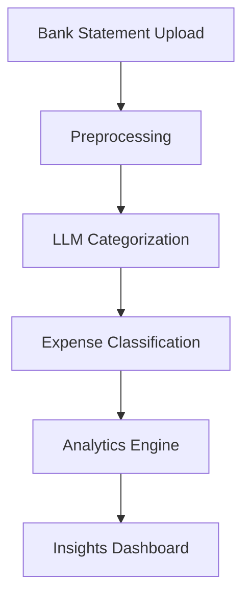
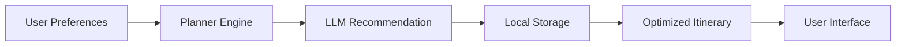
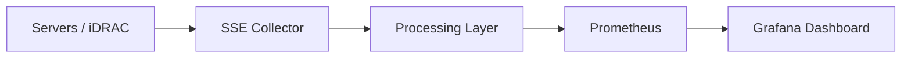

<!-- HEADER -->

<h1 align="center">Hi 👋, I'm Abhishek</h1>
<h3 align="center">🚀 AI Engineer | GenAI | Data Systems | Building Intelligent Products</h3>

<!-- TYPING ANIMATION -->

<p align="center">
  
</p>

---

## 🧠 About Me

* 🔭 Working on **GenAI, LLM apps & telemetry pipelines**
* 🤖 Exploring **Agentic AI & on-prem AI infrastructure**
* 📊 Focused on **AI + Data Engineering + Scalable Systems**
* 🏸 Fitness + Badminton enthusiast

---

## 🌐 My Website

<p align="left">
  <a href="https://your-website.com" target="_blank">
    
  </a>
</p>

---

## ⚙️ Tech Stack

<p align="left">
  
</p>

<p align="left">
  
  
  
  
</p>

---

## 🚀 Featured Projects

### 🔹 AI Chatbot (LLM + RAG)

* Multi-document querying using **ChromaDB**
* Streamlit-based conversational UI
* Scalable architecture

---

### 🔹 Finance Analyzer

* AI-powered expense categorization
* Insights on spending & savings
* LLM + analytics integration

---

### 🔹 Pathcraft – AI Travel Planner

* Personalized travel recommendations
* Offline-first intelligent planner

---

### 🔹 Telemetry Pipeline Optimization

* Reduced registration time significantly
* SSE-based high-performance collectors

---

## 🏗️ System Architecture

### 🔹 LLM Chatbot (RAG Architecture)

```mermaid
flowchart LR
    A[User Query] --> B[Frontend (Streamlit)]
    B --> C[Backend API]
    C --> D[Embedding Model]
    D --> E[Vector DB (Chroma)]
    E --> F[Retriever]
    F --> G[LLM]
    G --> H[Response]
    H --> B
```

---

### 🔹 Finance Analyzer (AI Pipeline)



---

### 🔹 Pathcraft – AI Travel Planner



---

### 🔹 Telemetry Pipeline (Data Engineering)



---

## 📫 Connect With Me

<p align="left">
  <a href="https://linkedin.com/in/your-linkedin" target="_blank">
    
  </a>
</p>

---

## ⚡ Fun Fact

💡 I love building **real-world AI systems that scale**, not just demos

---

⭐ *“Turning ideas into intelligent systems that scale.”*
